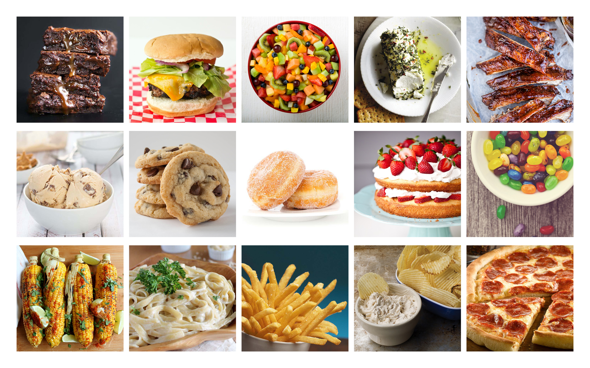

# FoodIE Stimuli

The Food Images Eugene (FoodIE) stimuli set is a collection of images designed to elicit food cravings. The stimuli set includes 15 categories of foods, each rated only by individuals reporting cravings for that category of food. For each image, participants were asked "how much do you desire to eat the item shown in this picture?" and rated their desire using a 5-point Likert-type scale, where 1 = no desire and 5 = strong desire.

The food categories each contain 60-70 appetizing images and include: barbeque, burgers, candy, cheese, chips, chocolate, cookies, doughnuts, French fries, fruit, fruit desserts, pasta, pizza, and roasted vegetables.

This repository contains code and ratings for the stimuli set.

Code and graphs can be found [here](FoodIE_norming.md).

To download the images, please visit the [DSN lab webpage](https://dsn.uoregon.edu/foodIE/)
